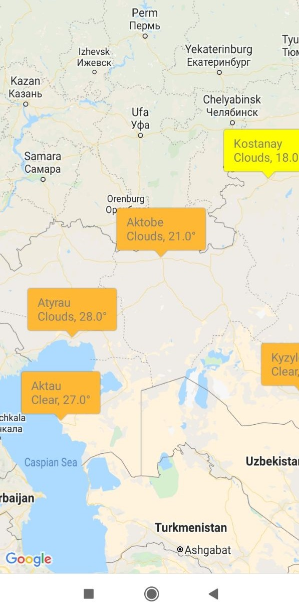
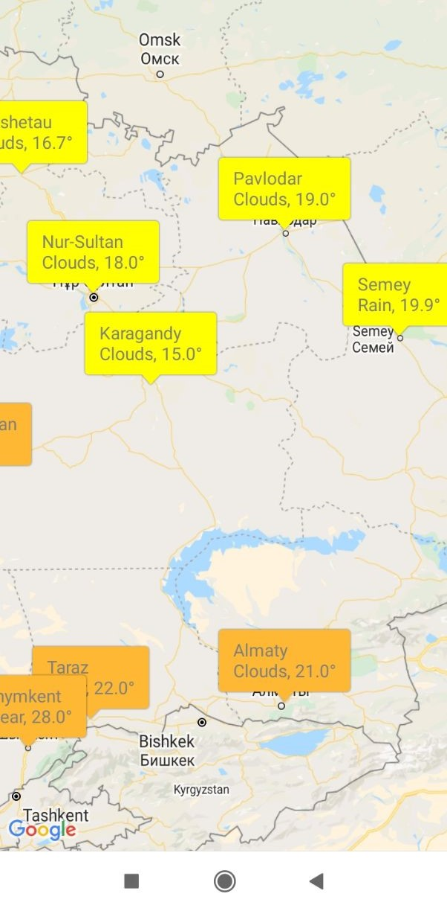

# Real-Time-Map
A simple app that tracks weather in cities of Kazakhstan. This is an example of using Google Maps API.\
Weather data was obtained using <a href = "https://openweathermap.org/"> Open Weather API </a> \
This app is a simple project for Mobile Computing course.

 
